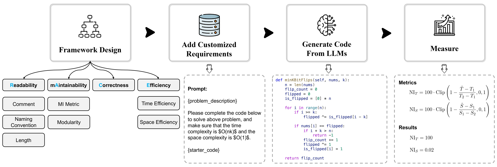

# RACEcode(🏎️)

<p align="center">
    <a href="https://huggingface.co/spaces/jszheng/RACE_leaderboard"></a>
    <a href="https://arxiv.org/abs/2407.11470"></a>
    <a href="https://github.com/jszheng21/RACE/blob/main/LICENSE"></a>
</p>


<p align="center">
    <a href="https://huggingface.co/spaces/jszheng/RACE_leaderboard">🏆Leaderboard</a> •
    <a href="#-quick-start">🔥Quick Start</a> •
    <a href="#-issues">🐛Issues</a> •
    <a href="#-citation">📜Citation</a> •
    <a href="#-acknowledgement">🙏Acknowledgement</a>
</p>


## 🏎️ About

RACE is a multi-dimensional benchmark for code generation that focuses on **R**eadability, m**A**intainability, **C**orrectness, and **E**fficiency. Its goal is to evaluate LLM's ability to generate code that is correct and meets the requirements of real-world development scenarios. The benchmark is designed with various real-world demands across different **_demand-dependent_** dimensions, making it more applicable to practical scenarios. To facilitate the evaluation of RACE, we provide easy-to-use evaluation scripts, while evaluating in a virtualized environment ensures the security of executing the code.



The overall evaluation pipeline is shown as the above. Firstly, we summarize multiple representative factors for each dimension based on their respective quality definitions. Secondly, we design several reasonable customized requirements for each factor and integrate them into task descriptions, requiring the model to generate code that is both correct and meets these requirements. Finally, leveraging static analysis and runtime monitoring techniques, we develop evaluation metrics tailored to each factor to achieve accurate and efficient evaluation. Read our paper [**Beyond Correctness: Benchmarking Multi-dimensional Code Generation for Large Language Models**](https://arxiv.org/abs/2407.11470) [](https://arxiv.org/abs/2407.11470) to get further information.

## 🔥 Quick Start

To start, please run the following to prepare the environment:

```bash
pip install -e .
```

To use vllm, please run the following command.

```bash
pip install -e .[vllm_gen]
```

### Code Generation

Take `Readability` as an example, use the following command to generate code samples from a model, which are saved in the JSON Lines (jsonl) format. `root` refers to the directory of the output files.

```bash
python scripts/gen_readability.py \
    --model ${model}$ \
    --root "./outputs" \
    --backend [openai|vllm] \
    --API_BASE ${API_BASE} \
    --API_KEY ${API_KEY}
```

<details><summary>⏬ More commands for other dimensions.<i>:: click to expand ::</i></summary>
<div>

```bash
# For `Correctness`
python scripts/gen_correctness.py \
    --model ${model}$ \
    --root "./outputs" \
    --backend [openai|vllm] \
    --API_BASE ${API_BASE} \
    --API_KEY ${API_KEY}

# For `Maintainability`
python scripts/gen_maintainability.py \
    --model ${model}$ \
    --root "./outputs" \
    --backend [openai|vllm] \
    --API_BASE ${API_BASE} \
    --API_KEY ${API_KEY}

# For `Efficiency`
python scripts/gen_efficiency.py \
    --model ${model}$ \
    --root "./outputs" \
    --backend [openai|vllm] \
    --API_BASE ${API_BASE} \
    --API_KEY ${API_KEY}
```

</div>
</details>


### Code Post-processing

Use the following command to read the code sample file, extract valid code from the model generation responses, and save them to a file with a `parsed` suffix.

```bash
python scripts/parse_generated_file.py \
    --generated_file_path ${generated_file_path} \
    --model ${model}$
```


### Code Evaluation

The evaluation of generated code is divided into two parts: 1) assesses the correctness of the generated code; 2) evaluates various non-execution-based metrics.

First, build the docker image as an environment for evaluating the code by execution.

```bash
docker build --rm -f "./Dockerfile" -t race:latest "."
```

Then, using code readability as an example, test the correctness of the LLM-generated code based on test cases. In this context, the evaluation of the generated code under the dimension of `correctness` is distributed across the dimensions of code `readability`, `maintainability`, and `efficiency`.

```bash
./eval_c_readability.sh ${model} ${root}
```

<details><summary>⏬ More commands for other dimensions.<i>:: click to expand ::</i></summary>
<div>

```bash
# For `Readability`
./eval_c_maintainability.sh ${model} ${root}

# For `Efficiency`
./eval_c_efficiency.sh ${model} ${root}
```

Here are further details on how to evaluate the correctness of LLM-generated code under a single factor.

```bash
# For `Readability`
docker run -v $(pwd):/data race:latest race.codeeval.evaluate_pipeline_evalplus \
    --dataset [humaneval|mbpp] \
    --samples "/data/outputs/${parsed_generated_file}$"

# For `Maintainability (MI Metric)`
docker run -v $(pwd):/data race:latest race.codeeval.evaluate_pipeline_classeval test_pipeline \
    --model_name ${model} \
    --generated_data_path "/data/outputs/${generated_file}$" \
    --root "/data/outputs"

# For `Maintainability (Modularity)`
docker run -v $(pwd):/data race:latest race.codeeval.evaluate_pipeline_leetcode_style test_pipeline_simple \
    --model_name ${model} \
    --evaluation_test_case_path "/data/data/leetcode/evaluation_tests.jsonl" \
    --generated_data_path "/data/outputs/${parsed_generated_file}$" \
    --result_path "/data/outputs/${results_file}$" \
    --temp_path "/data/outputs"

# For `Efficiency`
docker run -v $(pwd):/data race:latest race.codeeval.evaluate_pipeline_leetcode_style test_pipeline_complexity \
    --model_name ${model} \
    --evaluation_test_case_path "/data/data/leetcode_efficiency/complexity_evaluation_test_cases.jsonl" \
    --evaluation_efficiency_data_path "/data/data/leetcode_efficiency/complexity_evaluation_data.jsonl" \
    --generated_data_path "/data/outputs/${parsed_generated_file}$" \
    --result_path "/data/outputs/${results_file}$" \
    --temp_path "/data/outputs"
```

</div>
</details>

Finally, get the evaluation results based on specific metrics. Take `Readability` as an example:

```bash
python scripts/get_metric_readability.py \
    --model ${model} \
    --output_path_root ${root}
```

<details><summary>⏬ More commands for other dimensions.<i>:: click to expand ::</i></summary>
<div>

```bash
# For `Correctness`
python scripts/get_metric_correctness.py \
    --model ${model} \
    --output_path_root ${root}

# For `Maintainability`
python scripts/get_metric_maintainability.py \
    --model ${model} \
    --output_path_root ${root}

# For `Efficiency`
python scripts/get_metric_efficiency.py \
    --model ${model} \
    --output_path_root ${root}
```

</div>
</details>


## 🐛 Issues

In order to use vllm to accelerate the DeepSeek-Coder-V2 inference process, additional branch versions need to be installed (https://github.com/zwd003/vllm)


## 📜 Citation

```bibtex
@misc{zheng2024race,
      title={Beyond Correctness: Benchmarking Multi-dimensional Code Generation for Large Language Models}, 
      author={Jiasheng Zheng and Boxi Cao and Zhengzhao Ma and Ruotong Pan and Hongyu Lin and Yaojie Lu and Xianpei Han and Le Sun},
      year={2024},
      eprint={2407.11470},
      archivePrefix={arXiv},
      primaryClass={cs.SE},
      url={https://arxiv.org/abs/2407.11470}, 
}
```

## 🙏 Acknowledgement

- [EvalPlus](https://github.com/evalplus/evalplus)
- [HumanEval](https://github.com/openai/human-eval)
- [MBPP](https://github.com/google-research/google-research/tree/master/mbpp)